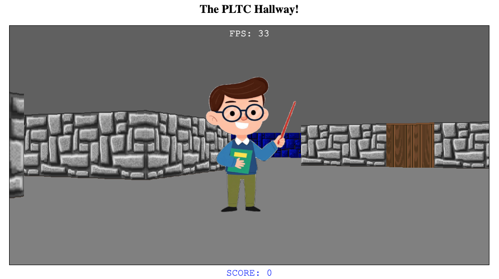

# The Wolf HCØ/PLTC Experience

This program is a Standard ML port (and a modification) of Jacob Seidelin's
JavaScript implementation of a Wolfenstein 3D-like game using raycasting [3,4] and
DOM-manipulations [1,2]. The Standard ML code is (re)translated into JavaScript
using SmlToJs [5].

## Assumptions

To compile the sources, you need to install
[MLKit](https://github.com/melsman/mlkit), which includes the SmlToJs compiler
`smltojs`.

## Compilation

Assuming `smltojs` is installed, simply run `make deploy`:

```
  $ make deploy
  ...
  [Created file index.html]
  ...
  cp -a data deploy/
```

To start the program in a browser (on http://localhost:8000), first start a web-server in the `deploy` folder:

```
  $ (cd deploy && python -m SimpleHTTPServer 8000)
```
or
```
  $ (cd deploy && python3 -m http.server 8000)
```

Now, fetch http://localhost:8000. You should see something like the following screen:



You navigate using keyboard arrows. There is currently no game play. Just walk
around and look at the slide decks in the different staff offices...

The process of building, deploying, and starting the web server may be combined using
```
  $ make serve
```

## Proper Deployment at the PLTC Web Site

To properly deploy the modified sourses into the `pltc` home page, run
```
  $ make dodeploy
```
and commit and push the changes.

## Notes and Design Aspects

### Data organisation

Data is organised in a data folder, as follows:
```
  data/
    gameMap.txt
    staff.json
    athas/
      array21/
        array21.pdf           // used only for generating png and txt files
        array21-000.png ...   // slide pages to be viewed
        array21-023.png
        array21-001.txt ...   // text to be spoken
    mael/
	  array25/
	  datoek2026/
```

Based on the staff.json-file, we can learn about what slide decks are available
and the proper slides can be shown and the proper txt-file can be spoken (with
the proper audio). See the current [data/staff.json](data/staff.json) for
details about the json layout.

The player moves around and interacts with screens, which show
presentations. There is a map from screens to pairs of a presentation object and its current page offset.

When a player is close to a screen, the player may select (by pressing `s`)
among presentations associated with the character who owns the screen. There is
a mapping from locations to pairs of a screen and an owner.

When a player is close to a screen, the player may also advance or rewind the
current presentation by pressing `n` (for next) or `p` (for prev). When the
current page changes, the current speech synthesis is cancelled
(`window.speechSynthesis.cancel()`) and the speech synthesis for the new
current page is started.

### Generating slide decks

Multi-page pdfs of size 16:9 may be split up
into multiple pngs, using the following ImageMagick command - extended to fit
in two squares:
```
$ magick -density 288 datoek.pdf -background white -alpha background -alpha off -resize 75% -gravity center -extent 1634x817 datoek-%03d.png
```

### Generating a default screen

A default slide, to be located in a staff folder as `default/default-000.png`, may be generated as follows:
```
$ magick -background lightblue -fill blue -pointsize 100 -gravity center label:'Fritz Henglein\nOffice: S10' -alpha background -alpha off -extent 1634x817 -resize 75% empty-000.png
```
This slide is shown when there are no other slides associated with the staff person.


### Annimated gifs

Use `gifsicle` to resize (extend) an animated gif:
```
$ gifsicle --resize 512x512 -i professor1.gif > professor5.gif
```

### Floor

We may implement a floor using the technique demonstrated at
https://codepen.io/melsman/pen/PwGYEXg

The technique needs to be tweaked to implement the correct perspective and the
angle (the `rotateZ` transform) is not directly the angle of view...

## License

MIT-License.

## Resources

[1] https://web.archive.org/web/20121220071947/http://dev.opera.com/articles/view/creating-pseudo-3d-games-with-html-5-can-1

[2] https://web.archive.org/web/20121222001735/http://dev.opera.com/articles/view/3d-games-with-canvas-and-raycasting-part-2

[3] https://lodev.org/cgtutor/raycasting.html

[4] https://lodev.org/cgtutor/raycasting2.html

[5] Martin Elsman. SMLtoJs: Hosting a Standard ML Compiler in a Web Browser. In
ACM SIGPLAN 2011 International Workshop on Programming Language And Systems
Technologies for Internet Clients (PLASTIC ‘11). Portland, Oregon,
USA. October, 2011. [pdf](https://elsman.com/pdf/smltojs-final.pdf).
